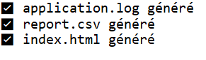

# 🧠 TP12 - Programmation JAVA

Ce projet contient les exercices du TP12 en JAVA.

## 📸 Captures d’écran

Voici les résultats d’exécution :

Exercice 1 :



Exercice 2:


---

## ⚙ Compilation
```bash
g++ main.java -o main
./main
